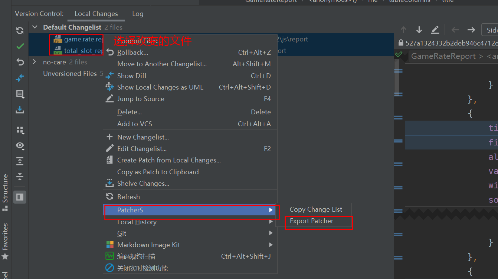
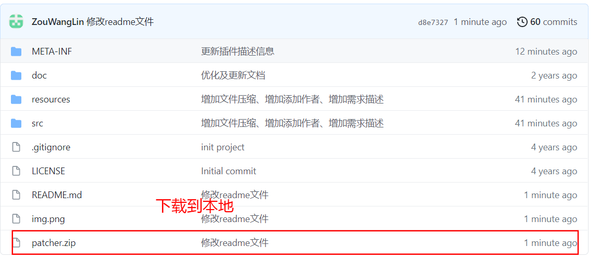
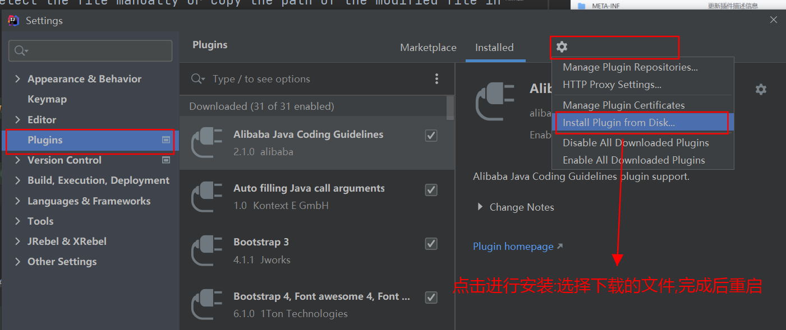

## 介绍

1. PatcherS是一款导出增量补丁文件的IDEA插件，因奇葩的增量部署而生，为开发者省去了很多繁琐操作。
2. 建议IDEA版本升级至2017或2017以上版本。

- 基于serical的代码改造而来，感谢：https://github.com/serical/patcher
- 基于fun90的代码改造而来，感谢：https://github.com/fun90/patcher
**下载**：

主要功能：
1. 可以手动选择导出的修改过的编译文件或源码文件
2. 可以在Version Control中按修改日志导出的修改过的编译文件或源码文件
3. 可以手动选择文件或在Version Control中复制修改过的文件路径
4. 自动压缩导出的文件

Description:
1. you can manually select the exported modified compiled files or source code files.
2. you can export the modified compiled files or source code files in Version Control according to the revision log.
3. you can select the file manually or copy the path of the modified file in Version Control.

界面预览：

## 安装

## 更新日志：

1. 2021-04-22 新增特性：新增需求人和需求描述</li>
2. 2021-04-22 新增特性：导出文件区分层级并压缩</li>
3. 2021-04-21 新增特性：导出文件名默认为ROOT</li>